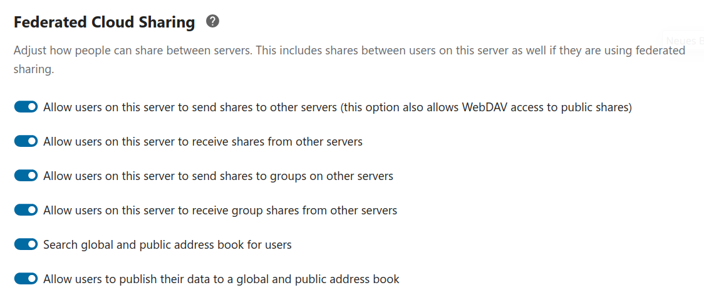

## Federation

The federation is created implicitedly by way of each instance installing the VO Federation app and configuring a common Community AAI. It is paramount at this stage of development that each instance manually adds all other instances as trusted instances to their configuration.

Before continuing please make sure the VO Federation app is properly installed and activated.

### Enable sharing

Please navigate to `/settings/admin/sharing` and activate the following settings:

* Allow users on this server to send shares to groups on other servers
* Allow users on this server to receive group shares from other servers

These settings are part of Nextcloud internal [Federation Sharing](https://docs.nextcloud.com/server/latest/admin_manual/configuration_files/federated_cloud_sharing_configuration.htm).
	
### Configuring Community AAIs

As the administrator user navigate to `/settings/admin/community-aais`. The settings page allows you to create, update or delete one or more Community AAIs. Changes to active Community AAIs may affect existing shares or VO group memberships, see [limitations](#Limitations)

The Community AAI must implement the [OIDC Authorization Code Flow](https://openid.net/specs/openid-connect-core-1_0.html#CodeFlowAuth).

**OIDC settings**

| Setting | Description |
| ------- | ----------- |
| Name | Application specific name |
| Client ID | The client identifier issued to the client during the registration process |
| Client secret | The client secret |
| Authorization endpoint | The Authorization Endpoint performs Authentication of the End-User  |
| Token endpoint | To obtain an Access Token, an ID Token, and optionally a Refresh Token |
| JWKS endpoint | Used for token validation |
| Userinfo endpoint | The UserInfo Endpoint returns Claims about the authenticated End-User. |
| Scope | Specifies what access privileges are being requested for Access Tokens |
| Extra claims | Used to request individual Claims |

**Attribute mapping**

These settings define how the claims returned by the Userinfo endpoint are used by the app.

| Setting | Description |
| ------- | ----------- |
| User ID mapping | Claim used as Identifier for the End-User at the Issuer |
| Display name mapping | Claim used to show End-User's name in displayable form |
| Groups mapping | Claim used for VO group membership information |
| Regex pattern | Regex pattern used to synthesize a VO group display name from the raw VO group membership information |

### VO display names

The regex pattern is fed as `pattern` to the PHP function [preg_match](https://www.php.net/manual/en/function.preg-match.php). The text that matched the first captured parenthesized subpattern `matches[1]` is used as the VO group display name.

### Adding trusted instances

You need to list all instances that should receive outgoing shares. Omit your own instance. Use fully qualified URLs.

## Limitations

* Changes to the OpenID Provider will cause all users to be disconnected and losing access to group shares until reconnection
  * Changing the regex pattern is a safe operation
* Newly added instances will not receive existing shares

